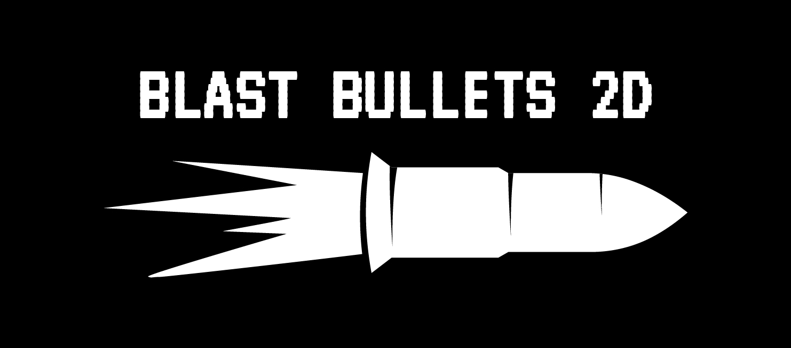

<p align="center">
  
</p>

## 🚀 Purpose

**BlastBullets2D** is a high-performance, **free and open source** C++ plugin for [Godot Engine](https://godotengine.org) that enables **optimized bullet spawning and management** in 2D games. It’s designed to efficiently handle a large number of bullets with minimal performance overhead, making it ideal for fast-paced, bullet-heavy gameplay.

Compared to standard methods like using `Area2D` with `AnimationPlayer`, **BlastBullets2D** offers a **significant performance boost**. In addition to speed, it includes built-in support to **save and load bullet states** with simple `save()` and `load()` functions.

If you're searching for a **Godot optimized bullets plugin**, **BlastBullets2D** is built exactly for that purpose.

The plugin comes precompiled for the following platforms:
- **Windows**
- **macOS**
- **Linux**
- **Android**
- **iOS**
- **Web**

✅ **BlastBullets2D is fully cross platform now, because it uses the [godot-plus-plus template](https://github.com/nikoladevelops/godot-plus-plus)**. If you also want to write C++ code in Godot or you have some old GDExtension plugins you want to update, I suggest checking it out

**BlastBullets2D** integrates seamlessly into your Godot project. You do not need any knowledge of C++ to use it. Everything is controlled through **GDScript**, made possible by Godot’s [GDExtension](https://docs.godotengine.org/en/stable/tutorials/scripting/gdextension/what_is_gdextension.html) system.

---

## ✅ Why Choose BlastBullets2D?

<p align="center">
  
</p>

If you're developing a bullet-hell shooter or any game that involves a high number of 2D bullets, **BlastBullets2D** provides a powerful and easy-to-use solution that delivers outstanding performance inside Godot Engine.

Video introduction of the plugin
https://www.youtube.com/watch?v=eMvR3UWXtH0

Video showing some of the features of the plugin
https://youtu.be/SeyD1YVIZss?si=oNXiFWNMiCd7JcZw


<details>
<summary><b>✨ What's New In Version 2.0</b></summary>

- **Physics Interpolation**  
  Bullets will always appear smooth when this option is enabled, regardless of the device's physics tick rate or refresh rate (perfect for monitors above 60Hz).

- **Bullet Attachments**  
  You can now attach particles, sprites, or any other nodes to bullets. These attachments move with the bullet and have their state saved and loaded automatically.

- **Instance Shader Parameter Support**  
  Instance shader uniform values are now automatically saved and loaded. This is useful when using custom per-instance variables in shaders.

- **Z-Indexing**  
  Z index is now available as a configurable data property.

- **Object Pool API**  
  Simplified object pooling functions are now provided.

- **Rotation-Based Direction Control**    
  Bullet movement can now be adjusted automatically based on rotation data.

- **In-Editor Documentation**    
  Every function and property now includes documentation viewable directly inside the Godot editor.

- **Crash Fixes**     
  Known crash issues have been resolved.

- **Collision Sync Fixes**    
  Collision state synchronization has been improved and made more reliable.

- **Refactored C++ Codebase**    
  The C++ source code has been refactored to be cleaner and more extendable for future development.

- **Test Game Project**   
  A fully functional game project is included to help you test all plugin features and compare performance against `Area2D`-based bullets.

- **New Helpful Functions And Properties**    
  Comes with way more helpful functions and properties to make your life easier!

</details>


<details>
<summary><b>📦 Core Features Of BlastBullets2D</b></summary>

- Efficient rendering using `MultiMeshInstance2D`
- High performance thanks to full C++ implementation (no GDScript bottlenecks)
- Built-in object pooling to minimize memory allocation overhead
- Save and load the state of all active bullets
- Debug collision shapes to visually inspect collision behavior
- Movement properties: speed, max speed, acceleration
- Rotation control: rotation speed, max rotation speed, rotation acceleration
- Customizable collision layers and masks via bitmasks
- Bullet animation through texture swapping over time
- Control over texture size and collision shape size
- Control over collision shape position offset relative to texture center
- Bullet lifetime control via `max_life_time`
- Support for custom `Material` and `Mesh` (ideal for shader use)
- Built-in `area_entered` and `body_entered` signals similar to `Area2D`
- Support for custom bullet data (e.g., `armor_damage`, `magic_damage`, `bullet_type`)  
  This data is automatically saved, loaded, and passed to signals for use when bullets hit targets.

</details>


<details>
<summary><b>⚠️ When Not To Use BlastBullets2D</b></summary>

While **BlastBullets2D** is highly optimized and feature-rich for top-down 2D games, there are a few limitations you should be aware of:

- ❌ **Y-sorting is not supported**  
  If your game relies heavily on Y-based depth sorting (common in platformers or isometric games), this plugin may not be a good fit.

- ❌ **Only `RectangleShape2D` is supported for collisions**  
  Currently, other collision shapes like `CircleShape2D` or `ConvexPolygonShape2D` are not supported.

- ❌ **Only Area2D like behavior**  
  All bullets act as `Area2D` - they are not `RigidBody2D` and don't support bouncing off of other bullets and so on. Basically you can NOT apply impulse forces. Just view them as `Area2D` bullets.

In conclusion, **BlastBullets2D is ideal for top-down shooters and arcade-style games**, but may not be suitable for other 2D genres if those specific features are essential to your project.

</details>

---

## How To Install
#### BlastBullets2D targets <b>Godot Engine 4.4.1</b>. As long as there are no breaking changes to GDExtension in the future, then it should work for all future 4.4.x Godot releases.

1. Go in [Releases](https://github.com/nikoladevelops/godot-blast-bullets-2d/releases) and on the latest release click and download `blastbullets2d.zip`

Note: <b>BlastBullets2D</b> is also available in: [Godot Asset Library](https://godotengine.org/asset-library/asset/2632) and [Itch.io](https://realnikich.itch.io/blastbullets2d).

2. Extract the zip and you will get a single folder `blastbullets2d`
3. Open your <b>Godot</b> game project and paste the folder inside. No matter if you place it inside an `addons` folder or the root of the project, the plugin will still work


The compiled plugin files have been loaded and you are ready to begin coding!

All functions and properties have been documented <b>INSIDE THE EDITOR</b>, so it will be extremely easy for you to take full advantage of all features.

If you want to benchmark/compare performance of `BlastBullets2D` bullets to `Area2D` bullets you can download the second zip file `test_project.zip` that contains the test project showcased in the gif and in the videos on my [Youtube Channel](https://www.youtube.com/@realnikich). I will post some tutorials there so make sure you subscribe

---
## How To Use
When designing the API, I've ensured that it's as easy as possible for anyone no matter the skill level to use this plugin. The only node that you are interested in is the `BulletFactory2D` and it's spawn functions. You should add it to your scene, attach a script and make it into an [Autoload/Singleton](https://docs.godotengine.org/en/stable/tutorials/scripting/singletons_autoload.html) or just keep it's reference (using a static variable) so that you can easily use it in any script (player/enemies). The only classes that you should be making new instances of is the data resource classes - `DirectionalBulletsData2D` and `BlockBulletsData2D` that you pass to the `BulletFactory2D`'s spawn functions - `spawn_directional_bullets()` and `spawn_block_bullets()` as well as the `BulletSpeedData2D` and `BulletRotationData2D` that are needed by those two data resource classes for proper set up.

Additionally you can read the `BulletAttachment2D` documentation to see how you can attach particles, sprites or any other custom nodes you have that need to move along with the bullets.

That's all! You just have to ensure that you are setting the data resource classes' properties correctly (read the documentation of the plugin that is available in the editor) and then play around modifying the properties during runtime, nothing complex, it's super simple! You can always check out the test project for some inspiration.

Here is how the basic setup goes:
1. Add a `BulletFactory2D` node to your scene tree. The BulletFactory's job is to spawn bullets and manage plugin related options (debugger, physics interpolations and so on..).
2. Attach a script to the factory. The `BulletFactory2D` node has the signals `area_entered`, `body_entered` and `life_time_over`. You should handle them in your script and write custom logic for your game.

You should probably keep a reference to the factory globally, so you can access it in any other script(enemies/player). There's two ways of doing this.

The first way would be to create an [Autoload/Singleton](https://docs.godotengine.org/en/stable/tutorials/scripting/singletons_autoload.html) where you keep the factory as a variable.

The second way would be to create a class with a static variable that keeps the reference of the factory. I personally prefer using this way.

Example:

```
# globals.gd - script for global variables

class_name GLOBALS

static var BULLET_FACTORY:BulletFactory2D

```

Then inside your main level script, you need to save the reference of your factory inside the `BULLET_FACTORY` static variable like so:
```
# main.gd - script of the main scene, where the factory is located

extends Node

func _ready():
	GLOBALS.BULLET_FACTORY = $BulletFactory2D # save a reference to the factory

```

Now the factory can be accessed through any script by doing this
```
# myscript.gd - script where you need to spawn bullets (enemy/player)

func spawn_bullets()->void:
	GLOBALS.BULLET_FACTORY.spawn_directional_bullets(bullets_data)
```

3. Use the `BulletFactory2D`'s functions to spawn bullets in any other script. You can use either `spawn_directional_bullets()` or `spawn_block_bullets()`.
4. To save the bullet state you can call the `save()` and `load()` functions of your `BulletFactory2D` node and then handle the signals `save_finished` and `load_finished`.

To handle the collisions properly and apply damage to enemies/player or any other custom data, you have to deal with [`Custom Resources`](https://docs.godotengine.org/en/stable/tutorials/scripting/resources.html). Inside the data resource class you've chosen (either `DirectionalBulletsData2D` or `BlockBulletsData2D`) you should attach a custom resource with properties such as `damage` - this is done by setting the `bullets_custom_data` property to your custom resource class. The same knowledge is needed when you are trying to save/load data. If you are not familiar with this concept or how to implement all of that then I suggest watching my [Godot Custom Resources For Beginners Tutorial](https://youtu.be/fdRJqnOrz98?si=gstLFNWaCcrENnjJ).

#### What's the difference between `DirectionalBulletsData2D` and `BlockBulletsData2D`?

- `DirectionalBulletsData2D` is used when you want to spawn a huge amount of bullets and each bullet travels in its own unique direction that is determined by its `Transform2D`. Ensure that the **MANDATORY** `all_bullet_speed_data` property is set to an array of `BulletSpeedData2D` and the amount of values matches the amount of values inside the `transforms` property or you will experience a crash.


- `BlockBulletsData2D` is used when you want to spawn a huge amount of bullets as a block of bullets that travels in a single direction that is determined by the `block_rotation_radians` property. Here you need to set the `block_speed` property to a single `BulletSpeedData2D` - all bullets move at the same speed.

Both of these resource classes need to have their `transforms` property set to an array of `Transform2D` - this data determines the global position and rotation of all bullets. This property is **MANDATORY**, if you do not set it you will experience a crash. The amount of `Transform2D` will also determine the amount of bullets that need to be spawned - and again always ensure that the amount of `transforms` matches the amount of `BulletSpeedData2D` when using `DirectionalBulletsData2D`.


---

## Code Examples

After you've set up your `BulletFactory2D` and you can access it from anywhere it's time to spawn some bullets. You can use these code snippets and modify them to your needs:

#### Create Custom Resource Class For Damage Data

```
class_name DamageData
extends Resource

# The base damage amount
@export var base_damage:int
# Whether the bullet was spawned from the player
@export var is_player_owned:bool
```

#
#### Set Up Bullet Spawn Data

On top of your script you should have variables:
```
# These textures are used as animation frames for the bullets. 
# They are being iterated over again and again until the life time of the bullets is over.
var rocket_tectures:Array[Texture2D] = [
	preload("pathgoeshere"),
  preload("pathgoeshere")
  ... each texture you provide here makes up the animation
	]


# The default texture that can be used, instead of having animations
var godot_texture:Texture2D = preload("res://icon.svg")

# Holds data that is needed for factory.spawn_directional_bullets
var directional_bullets_data:DirectionalBulletsData2D

# Holds data that is needed for factory.spawn_block_bullets
var block_bullets_data:BlockBulletsData2D

# Holds data that is needed to set up the speed of both directional and block bullets
var bullet_speed_data:Array[BulletSpeedData2D]

# Holds data that is optional if we want to set up the rotation of both directional and block bullets
var bullet_rotation_data:Array[BulletRotationData2D]

# Holds the custom resource data to which we have access every single time a bullet hits something
var damage_data:DamageData
```

And now lets get some set up functions:
####
For `DirectionalBulletsData2D`
```
# Returns a partially set up DirectionalBulletsData2D, only thing left to do is set a new value to the .transforms property
func set_up_directional_bullets_data()->DirectionalBulletsData2D:
	var data:DirectionalBulletsData2D = DirectionalBulletsData2D.new()
	data.textures = rocket_tectures
	
	# You can also define wait time for each texture like so as long as the amount of textures matches the amount of values in this array.
	# Otherwise stick to using default_change_texture_time
	#data.change_texture_times = [
		#0.05,
		#0.03,
		#0.01,
		#0.02,
		#0.01,
		#0.01,
		#0.01,
		#0.08,
		#0.01,
		#0.03
	#]
	
	
	data.all_bullet_speed_data = bullet_speed_data # for the directional bullets use every single bullet speed
	
	#data.collision_layer = DirectionalBulletsData2D.calculate_bitmask([2])
	#data.collision_mask = DirectionalBulletsData2D.calculate_bitmask([3]) # by default bullets interact only with enemy
	data.set_collision_layer_from_array([2])
	data.set_collision_mask_from_array([3])

	data.texture_size = Vector2(140,140)
	data.collision_shape_size=Vector2(32,32)
	data.collision_shape_offset=Vector2(0,0)
	data.default_change_texture_time=0.09
	data.max_life_time = 2
	data.all_bullet_rotation_data = bullet_rotation_data
	data.bullet_attachment_offset = Vector2(-60,0)
	data.bullets_custom_data = damage_data
	#data.is_life_time_over_signal_enabled = true # If you want to track when the life time is over and receive a signal inside BulletFactory2D
	
	return data
```

For `BlockBulletsData2D`
```
# Returns a partially set up BlockBulletsData2D, only thing left to do is set a new value to the .transforms and .block_rotation properties
func set_up_block_bullets_data()->BlockBulletsData2D:
	var data:BlockBulletsData2D = BlockBulletsData2D.new();
	data.textures = rocket_tectures
	data.block_speed = bullet_speed_data[0] # for the block of bullets use only the first bullet_speed_data as the block_speed
	
	#data.collision_layer = BlockBulletsData2D.calculate_bitmask([2])
	#data.collision_mask = BlockBulletsData2D.calculate_bitmask([3]) # by default bullets interact only with enemy
	data.set_collision_layer_from_array([2])
	data.set_collision_mask_from_array([3])
	
	data.texture_size = Vector2(140,140)
	data.collision_shape_size=Vector2(32,32)
	data.collision_shape_offset=Vector2(0,0)
	data.default_change_texture_time=0.09
	data.max_life_time = 2
	data.all_bullet_rotation_data = bullet_rotation_data
	data.bullet_attachment_offset = Vector2(-60,0)
	data.bullets_custom_data = damage_data
	
	return data
```
#
#### Spawn Bullets

For `DirectionalBulletsData2D`
```
func spawn_multi_mesh_directional_bullets()->void:
	if bullets_amount < 10:
		directional_bullets_data.transforms = BulletFactory2D.helper_generate_transforms_grid(bullets_amount, bullet_marker.get_global_transform(), bullets_amount, grid_alignment, col_offset, row_offset, rotate_grid_with_marker, random_local_rotation)
	else:
		directional_bullets_data.transforms = BulletFactory2D.helper_generate_transforms_grid(bullets_amount, bullet_marker.get_global_transform(), rows_per_column, grid_alignment, col_offset, row_offset, rotate_grid_with_marker, random_local_rotation)
	
	BENCHMARK_GLOBALS.FACTORY.spawn_directional_bullets(directional_bullets_data)
```

For `BlockBulletsData2D`
```
func spawn_multi_mesh_block_bullets(player_rotation:float)->void:
	if bullets_amount < 10:
		block_bullets_data.transforms = BulletFactory2D.helper_generate_transforms_grid(bullets_amount, bullet_marker.get_global_transform(), bullets_amount, grid_alignment, col_offset, row_offset, rotate_grid_with_marker, random_local_rotation)
	else:
		block_bullets_data.transforms = BulletFactory2D.helper_generate_transforms_grid(bullets_amount, bullet_marker.get_global_transform(), rows_per_column, grid_alignment, col_offset, row_offset, rotate_grid_with_marker, random_local_rotation)
	
	
	block_bullets_data.block_rotation_radians=player_rotation # I want the block of bullets to be rotated the same way that the player is rotated
		
	BENCHMARK_GLOBALS.FACTORY.spawn_block_bullets(block_bullets_data)
```

#

#### Handle Collisions Inside BulletFactory2D Script
```
extends BulletFactory2D

@onready var particle_scn:PackedScene = preload("res://shared/bullet_attachment_nodes/attached_particles.tscn")

# BlastBullets2D plugin created by https://x.com/realNikich / https://github.com/nikoladevelops
# For tutorials: https://www.youtube.com/@realnikich

# NOTE NEVER OVERRIDE THE _ready FUNC HERE IF YOU ARE PLANNING TO ATTACH A CUSTOM SCRIPT. YOUR GAME WILL CRASH!!
# NOTE Depending on the enemy type (whether the thing being hit by the bullets is an area or a body), you need to handle either the _on_area_entered or _on_body_entered of the BulletFactory2D
# NOTE Ensure the enemy is in the correct collision_layer and that the bullets are also in the same collision_mask
# NOTE Static bodies can be hit by the bullets, but only if you set the data of the bullets's monitorable property to true - this is at the cost of performance of course, so it's better to stick with Area2D or other types of bodies
# Example: if enemy is in collision_layer = 3, then the bullets you are spawning should always have the collision_mask = 3 as well, otherwise they won't interact with eachother

# This function is connected to the area_entered signal of the bullet factory. It is executed each time a bullet spawned from the factory hits an Area2D (and again in order for a thing to be hit, ensure the layers are correct!)
func _on_area_entered(enemy_area: Object, bullets_custom_data: Resource, _bullet_global_transform: Transform2D) -> void:
	if enemy_area is AbstractEnemy:
		var dmg_data:DamageData = bullets_custom_data as DamageData # We know for a fact that we have a DamageData inside our bullets, because that's how we've set them up before spawning them - we can replace it with some other custom resource instead and check for its type here too (we may spawn bullets with different custom data and have additional check logic)
		if dmg_data.is_player_owned == false: # If it wasn't the player who spawned the bullet, then that means an enemy is hitting another enemy - I want the bullet to dissapear without it damaging the enemy (No friendly fire :P)
			return
		enemy_area.take_damage(dmg_data.base_damage) # You can do way more complex damage logic with the rest of the properties inside bullets_custom_data, you can do anything..
		#print("Bullet just collided with an enemy area")
	#else:
		#print("Bullet just collided with an area")

# This function is connected to the body_entered signal of the bullet factory.  It is executed each time a bullet spawned from the factory hits a body (and again in order for a thing to be hit, ensure the layers are correct and you also have enabled the .monitorable property inside bullets data!)
func _on_body_entered(enemy_body: Object, bullets_custom_data: Resource, _bullet_global_transform: Transform2D) -> void:
	if enemy_body is Player:
		var dmg_data:DamageData = bullets_custom_data as DamageData
		enemy_body.take_damage(dmg_data.base_damage)
		
	#print("Bullet just collided with a body")

# This function will only be executed if the bullets_data has the is_life_time_over_signal_enabled property set to TRUE
func _on_life_time_over(_bullets_custom_data: Resource, _all_bullet_global_transforms: Array) -> void:
	pass
	# Just a small example that you can spawn particles or other things in the same exact position where the bullet got disabled (its life time got to 0)
	#for t in all_bullet_global_transforms:
		#var instance:Node2D = particle_scn.instantiate()
		#instance.global_transform = t
		#get_tree().root.add_child(instance)

```
#
### What Is The `BulletAttachment2D` Node For?
Provides the functionality of bullets being able to carry particles or other nodes as they move.

In order for attachments to work correctly they need a unique `attachment_id` positive value.

The way you use attachments is the following:

1. Create a new scene that has a parent node of `BulletAttachment2D`.

2. Add any other nodes to the scene or logic to it - whatever the bullets are going to be carrying as they move.

3. Set the `attachment_id` inside `on_bullet_spawn()` and `on_bullet_spawn_as_disabled()` functions.

4. Configure any other custom logic in the rest of the functions (read the rest of the documentation carefully, you need to override the virtual functions to execute custom logic).

5. Set this attachment to a spawn data (`BlockBulletsData2D` or `DirectionalBulletsData2D`) by using the `bullet_attachment_scene` property and use one of `BulletFactory2D`'s spawn functions to spawn the actual bullets.

Example of implementing `BulletAttachment2D`

```
extends BulletAttachment2D

var current_color:Color = Color.WHITE
var change_color_max_time:float = 0.5
var curr_time:float = 0.0

func _physics_process(delta: float) -> void:
	if curr_time >= change_color_max_time:
		var rand_R:float = randf()
		var rand_G:float = randf()
		var rand_B:float = randf()
		
		current_color = Color(rand_R, rand_G, rand_B, 1)
		modulate = current_color
		
		curr_time = 0.0
	
	curr_time += delta
	
func on_bullet_spawn() -> void:
	attachment_id = 3

func on_bullet_spawn_as_disabled() -> void:
	attachment_id = 3 # Very important
	
	set_process(false)
	set_physics_process(false)
	visible = false
	
	curr_time = 0

func on_bullet_disable() -> void:
	visible = false
	set_process(false)
	set_physics_process(false)

func on_bullet_activate() -> void:
	curr_time = 0
	current_color = Color.WHITE
	modulate = current_color
	
	visible = true
	set_process(true)
	set_physics_process(true)
	

## When the BulletFactory2D saves bullet states, it will save this bullet attachment state
func on_bullet_save() -> Resource:
	var data:LightAttachmentData = LightAttachmentData.new()
	data.current_color = current_color
	data.current_time = curr_time
	
	return data
	
## Same resource we just saved will get passed here, so cast it and use the data you've saved
func on_bullet_load(custom_data_to_load: Resource) -> void:
	var data:LightAttachmentData = custom_data_to_load as LightAttachmentData
	if data != null:
		current_color = data.current_color
		curr_time = data.current_time
		
		modulate = current_color
```

#
#### Saving And Loading Bullets Data

```
# The save path at which the save file is being saved/loaded from
var save_path:String = OS.get_user_data_dir() + "/test.tres"; # could be either .tres or .res

func _on_save_btn_pressed():
	BENCHMARK_GLOBALS.FACTORY.save();

func _on_load_btn_pressed():
	var factory_data:SaveDataBulletFactory2D = ResourceLoader.load(save_path)
	if factory_data == null:
		print("Bullets data from file was invalid, loading failed.")
	else:
		BENCHMARK_GLOBALS.FACTORY.load(factory_data)
		
	
func _on_factory_save_finished(factory_data:SaveDataBulletFactory2D):
	if factory_data == null:
		print("Bullets data saving failed.")
	else:
		ResourceSaver.save(factory_data, save_path)
```

**All of these code snippets were taken from the test project in order to guide you in the right direction, you'll have to modify them to make them work for your own game**

---
## How To Compile

The easy way is to just fork the plugin, then go inside the GitHub Actions tab, and run the workflow for `full_plugin_compilation`, instead of `debug`. This easy process is due to using [godot-plus-plus template](https://github.com/nikoladevelops/godot-plus-plus) - allows for cross platform easy workflow when making Godot C++ GDExtension plugins

#
The hard way - doing it locally on your own devices

If you want to modify the C++ code and add custom logic or fix issues: 

1. Install [Python](https://www.python.org/downloads/).
2. Install [Scons](https://scons.org/).
```
python -m pip install scons
```
3. Install [Git](https://git-scm.com/)
4. Download source code of the plugin with included <b>godot_cpp</b> submodule.

```
git clone --recurse-submodules https://github.com/nikoladevelops/godot-blast-bullets-2d.git
```
5. Go to <b>main</b> folder where <b>SContrsuct.py</b> file is located.
Open your command terminal (Example: <b>cmd</b> on <b>Windows</b>) in the same directory then type one of these depending on the platform you are targeting (if you receive an error it means you don't have the required toolchain to compile for the platform you are targeting, so do some research on what you're missing):


#### For Windows x64

Set up the environment
```
"C:\Program Files\Microsoft Visual Studio\2022\Community\VC\Auxiliary\Build\vcvarsall.bat" amd64
```

Compile the code
```
scons platform=windows arch=x86_64 target=template_debug
scons platform=windows arch=x86_64 target=template_release lto=full
```

#### For Windows arm64
Set up the environment
```
"C:\Program Files\Microsoft Visual Studio\2022\Community\VC\Auxiliary\Build\vcvarsall.bat" amd64_arm64
```

Compile the code
```
scons platform=windows arch=arm64 target=template_debug
scons platform=windows arch=arm64 target=template_release lto=full
```

#### For Linux x64
It's possible to compile for Linux using [wsl](https://learn.microsoft.com/en-us/windows/wsl/install) if you are on Windows.
```
wsl --install
```
```
scons platform=linux arch=x86_64 target=template_debug
scons platform=linux arch=x86_64 target=template_release lto=full
```

#### For Android x64
Ensure you have an <b>Android SDK</b> (you can download <b>Android Studio</b> and get all the things you need from there). Here is some useful documentation [Compiling for Android](https://docs.godotengine.org/en/stable/contributing/development/compiling/compiling_for_android.html)

```
scons platform=android arch=x86_64 target=template_debug ANDROID_HOME=C:\Users\Admin\AppData\Local\Android\Sdk
scons platform=android arch=x86_64 target=template_release ANDROID_HOME=C:\Users\Admin\AppData\Local\Android\Sdk lto=full
```
#### For Android arm64
Ensure you have an <b>Android SDK</b> (you can download <b>Android Studio</b> and get all the things you need from there). Here is some useful documentation [Compiling for Android](https://docs.godotengine.org/en/stable/contributing/development/compiling/compiling_for_android.html)

```
scons platform=android arch=arm64 target=template_debug ANDROID_HOME=C:\Users\Admin\AppData\Local\Android\Sdk
scons platform=android arch=arm64 target=template_release ANDROID_HOME=C:\Users\Admin\AppData\Local\Android\Sdk lto=full
```

#### For Web
You need [emscripten SDK](https://emscripten.org/docs/getting_started/downloads.html). Put <b>emsdk</b> and emscripten's location inside environment variable <b>Path</b>.
Before trying to compile for web, each time you open your command terminal you need to run this
```
emsdk activate latest
```

After than run each of these:
```
scons platform=web target=template_debug
scons platform=web target=template_release lto=full
```

#### For IOS and macOS
Research on which toolchain you need for <b>IOS</b> and for <b>macOS</b>, download them and then run the same scons commands, but for your desired platform and other desired arguments.
See the official [GDExtension Documentation](https://docs.godotengine.org/en/stable/tutorials/scripting/gdextension/index.html) or search for some tutorials online. Sadly <b>GDExtenstion</b> is not well documented, so you might spend some time searching. I recommend joining <b>Godot's Discord Server</b> it has a <b>gdnative-gdextension channel</b> so you might find some help there.
  
</details>

---

## Support
If you wish to support me you can do so here - https://ko-fi.com/realnikich or https://patreon.com/realnikich

If you find this plugin useful:
- <b>Leave a Star on the repository</b>
- Expect tutorials on my YouTube channel - https://www.youtube.com/@realnikich
- [Follow me on X (Twitter)](https://x.com/realNikich)
- [Follow me on Bluesky](https://bsky.app/profile/realnikich.bsky.social)
